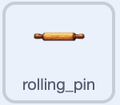
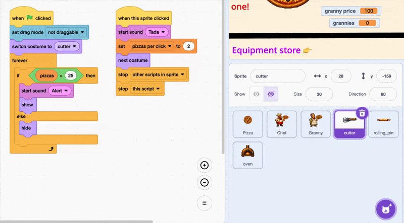

## Add the rolling pin

Build on the cutter prototype with another upgrade.

<h2 class="c-project-heading--explainer">What you need to do</h2>



## Step 1

Add a rolling pin, or another piece of equipment, as a new sprite. Resize it and place it beside the cutter. The example rolling pin is `30`% size.

Duplicate its costume and add a green tick to the second costume, just as you did for the cutter.

## Step 2

Copy both cutter scripts onto the rolling pin by dragging each script onto the rolling pin in the sprite list. Add the `Alert`{:class="block3sound"} and `Tada`{:class="block3sound"} sounds too.

--- no-print ---



--- /no-print ---

## Step 3

Update the copied scripts. The rolling pin costs `500` and adds `4` to `pizzas per click`{:class="block3variables"}. If the cutter was bought first, each click is now worth `6`.

```blocks3
when green flag clicked
set drag mode [not draggable v]
switch costume to (rolling_pin v)
hide
wait until <(pizzas) > (499)>
show
start sound (Alert v)
say [New equipment unlocked!] for (2) seconds
```

```blocks3
when this sprite clicked
if <<(costume [number v]) = (1)> and <(pizzas) > (499)>> then
start sound (Tada v)
change [pizzas v] by (-500)
change [pizzas per click v] by (4)
next costume
end
```

## Now run your code

Reach 500 pizzas and buy the rolling pin. Its green-tick costume appears and 500 pizzas are spent.
