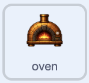

## Add the oven

Add one more equipment upgrade.

<h2 class="c-project-heading--explainer">What you need to do</h2>



## Step 1

Add an oven, or another piece of equipment, as a new sprite. Resize it and place it beside your other upgrades. The example oven is `17`% size.

Duplicate its costume and add a green tick to the second costume.

## Step 2

Copy the rolling pin's scripts onto the oven and add the same two sounds.

Update the scripts so the oven costs `3000` and adds `18` to `pizzas per click`{:class="block3variables"}. After buying the other two upgrades, this brings the total to `24`.

```blocks3
when green flag clicked
set drag mode [not draggable v]
switch costume to (oven v)
hide
wait until <(pizzas) > (2999)>
show
start sound (Alert v)
say [New equipment unlocked!] for (2) seconds
```

```blocks3
when this sprite clicked
if <<(costume [number v]) = (1)> and <(pizzas) > (2999)>> then
start sound (Tada v)
change [pizzas v] by (-3000)
change [pizzas per click v] by (18)
next costume
end
```

## Now run your code

Reach 3000 pizzas and buy the oven. Its green-tick costume appears and 3000 pizzas are spent.
