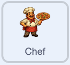

## Show the helper when affordable

Make the helper appear only when the player can pay the current price.

<h2 class="c-project-heading--explainer">What you need to do</h2>



```blocks3
when green flag clicked
set drag mode [not draggable v]
hide
forever
if <(pizzas) > ((chef price) - (1))> then
show
else
hide
end
end
```

## Tip

Scratch has no `greater than or equal to` block. Because the score uses whole numbers, checking for `pizzas > chef price - 1` does the same job.

## Now run your code

Click the green flag and build your score. The helper stays hidden up to 49 pizzas and appears when the score reaches 50.
