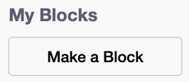

## Count the pizzas per second

Build a reusable block that works out how fast the helpers make pizzas.


## Step 1

Click the `Stage`{:class="block3looks"}.

In `My Blocks`{:class="block3custom"}, click **Make a Block**, name it `update pizzas per second`{:class="block3custom"}, and build its definition.

Each helper makes one pizza per second, so the rate is the same as `helpers`{:class="block3variables"}.



```blocks3
define update pizzas per second
set [pizzas per second v] to (helpers)
```

## Step 2

Add a script so any helper can ask for a recount. Make a new message called `update`{:class="block3events"}.

```blocks3
when I receive (update v)
update pizzas per second :: custom
```

## Tip

In many programming languages, a reusable block of code like this is called a **function**.

Nothing calls the block yet. You'll connect it to the helper next.
