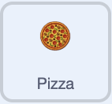
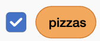

## Count your clicks

Keep score, and make each click add to it.

<h2 class="c-project-heading--explainer">What you need to do</h2>



## Step 1

Make a score variable and give it a sensible plural name, such as `pizzas`{:class="block3variables"}, `coins`{:class="block3variables"}, or `stars`{:class="block3variables"}.

Tick it so the player can see their score.




The example blocks use `pizzas`{:class="block3variables"}. If you chose another name, use your variable wherever you see `pizzas`{:class="block3variables"}.

## Step 2

Make your sprite clickable, so each click increases your score.

```blocks3
when this sprite clicked
change [pizzas v] by (1)
```

## Now run your code

Click your sprite. Your score goes up.
