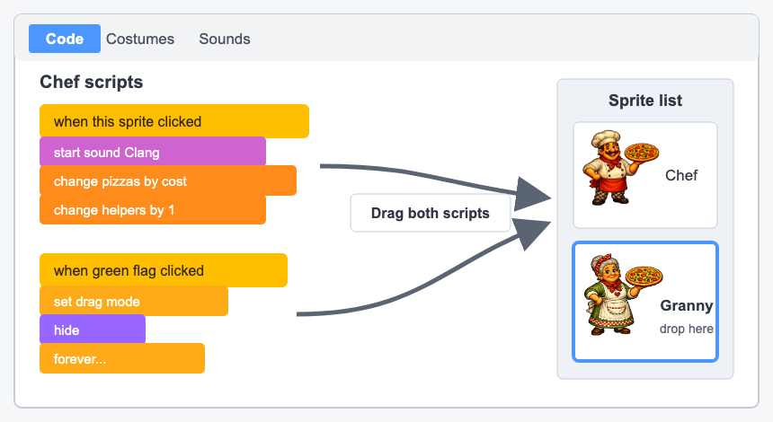

## Wire up the granny

Reuse the first helper's scripts, then point them at the granny's sound, count, and price.


## Step 1

Copy your first helper's two scripts onto the granny by dragging each script onto it in the sprite list.

--- no-print ---



--- /no-print ---

## Step 2

Update the copied buy script. Its affordability check prevents a quick extra click from spending more pizzas than the player has.

```blocks3
when this sprite clicked
if <(pizzas) > ((granny price) - (1))> then
start sound (Collect v)
change [pizzas v] by ((0) - (granny price))
change [grannies v] by (1)
set [granny price v] to (round ((granny price) * (1.15)))
broadcast (update v)
end
```

## Step 3

Update the copied green-flag script so the granny appears only when its own price is affordable.

```blocks3
when green flag clicked
set drag mode [not draggable v]
hide
forever
if <(pizzas) > ((granny price) - (1))> then
show
else
hide
end
end
```

The granny is safe to buy, but it does not add to the earning rate yet.
