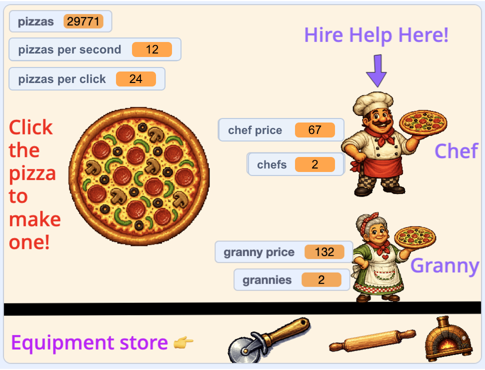

## Arrange your shop

Lay everything out so the player knows what to click and buy.

<h2 class="c-project-heading--explainer">What you need to do</h2>

## Step 1

Drag your sprites into place on the Stage.

The example puts the pizza in the middle, the helpers on the right, and the equipment along the bottom.

## Step 2

Arrange the variable readouts.

The example stacks `pizzas`{:class="block3variables"}, `pizzas per second`{:class="block3variables"}, and `pizzas per click`{:class="block3variables"} at the top left. It puts each helper's price and count beside that helper.

## Tip

The score, prices, and other information shown on top of a game are often called the **HUD**, short for **heads-up display**.

## Now run your code

Check that every sprite and readout is visible, nothing covers the instructions, and the helpers fit on the right. Your design can look completely different from the example.

