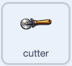

## Animate the equipment

Make the equipment wiggle so the shop feels alive.



## Step 1

Add this script to your first piece of equipment. It rocks the sprite back and forth forever.

```blocks3
when green flag clicked
forever
turn right (10) degrees
wait (0.05) seconds
turn left (10) degrees
wait (0.05) seconds
turn left (10) degrees
wait (0.05) seconds
turn right (10) degrees
wait (0.05) seconds
end
```

## Step 2

Drag the script onto your other equipment sprites to copy it to each one.

## Now run your code

Click the green flag. Each equipment sprite rocks gently and returns to its starting direction after every wiggle.
