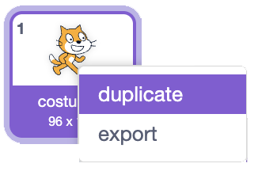

## Add equipment

Add equipment the player can unlock to make every click worth more.

> [!TASK]
>
> Make a variable called `pizzas per click`{:class="block3variables"}. This is how many pizzas one click makes.

> [!TIP]
>
> All the changing information a game remembers, like scores, prices, and upgrades, is called the **game state**.

> [!TASK]
>
> Click the `Stage`{:class="block3looks"} and set it to `1` on the green flag, so a click always makes at least one pizza.
>
> ```blocks3
> when green flag clicked
> set [pizzas v] to (0)
> +set [pizzas per click v] to (1)
> ```

> [!TASK]
>
> On your pizza sprite, make each click use the variable instead of a fixed `1`.
>
> ```blocks3
> when this sprite clicked
> start sound (Tennis Hit v)
> +change [pizzas v] by (pizzas per click)
> change size by (10)
> wait (0.05) seconds
> change size by (-10)
> ```

Nothing changes yet, because `pizzas per click`{:class="block3variables"} is still `1`. The equipment will raise it.

> [!TASK]
>
> Add your first piece of equipment as a new sprite. The pizza shop uses a cutter.
>
> Use your own equipment, or save [the cutter sprite](images/cutter.png) and import it with **Upload**.
>
> 

> [!TASK]
>
> Give it a second costume that shows it's been bought: in the **Costumes** tab, right-click the costume and choose **duplicate**, then change the copy (the pizza shop adds a green tick). Keep the plain costume first and the "bought" one second.
>
> 

> [!TASK]
>
> Make the equipment appear only once the player can afford it.
>
> ```blocks3
> when green flag clicked
> set drag mode [not draggable v]
> switch costume to (cutter v)
> forever
> if <(pizzas) > (25)> then
> start sound (Alert v)
> show
> else
> hide
> end
> end
> ```

> [!TIP]
>
> An **unlock condition** is a rule that makes something available only after the player has done enough.

> [!TASK]
>
> Make it buyable. Clicking it upgrades the player's clicks, switches to the "bought" costume, and shuts itself off so it can't be bought twice.
>
> ```blocks3
> when this sprite clicked
> start sound (Tada v)
> set [pizzas per click v] to (2)
> next costume
> stop [other scripts in sprite v]
> stop [this script v]
> ```

Click until you pass 25 pizzas. The cutter appears; click it and every click is now worth 2 pizzas.

> [!TASK]
>
> Add two more pieces of equipment. Copy the two cutter scripts by dragging each onto the new sprite in the sprite list, then change the numbers. The pizza shop's rolling pin appears above `499` and sets `pizzas per click`{:class="block3variables"} to `6`:
>
> Save [the rolling pin sprite](images/rolling_pin.png) and import it with **Upload** if you want to use the pizza shop's equipment.
>
> > [!NOPRINT]
> >
> > 
>
> ```blocks3
> when green flag clicked
> set drag mode [not draggable v]
> switch costume to (rolling_pin v)
> forever
> if <(pizzas) > (499)> then
> start sound (Alert v)
> show
> else
> hide
> end
> end
> ```
>
> ```blocks3
> when this sprite clicked
> start sound (Tada v)
> set [pizzas per click v] to (6)
> next costume
> stop [other scripts in sprite v]
> stop [this script v]
> ```
>
> 
>
> Add a third the same way: the oven appears above `3000` and sets `pizzas per click`{:class="block3variables"} to `24`. Give each sprite its own first costume in its "appear" script.
>
> Save [the oven sprite](images/oven.png) and import it with **Upload** if you want to use the pizza shop's equipment.
>
> 

> [!TASK]
>
> Make winning need all the upgrades. On your pizza, update the `wait until`{:class="block3control"} so the player needs a high score **and** all the equipment (which lands `pizzas per click`{:class="block3variables"} on `24`).
>
> ```blocks3
> when green flag clicked
> set drag mode [not draggable v]
> +wait until <<(pizzas) > (10000)> and <(pizzas per click) = (24)>>
> start sound (Win v)
> say [You Win!] for (2) seconds
> stop [all v]
> ```

Buy all three pieces of equipment. The win message now only appears once your shop is fully kitted out.
