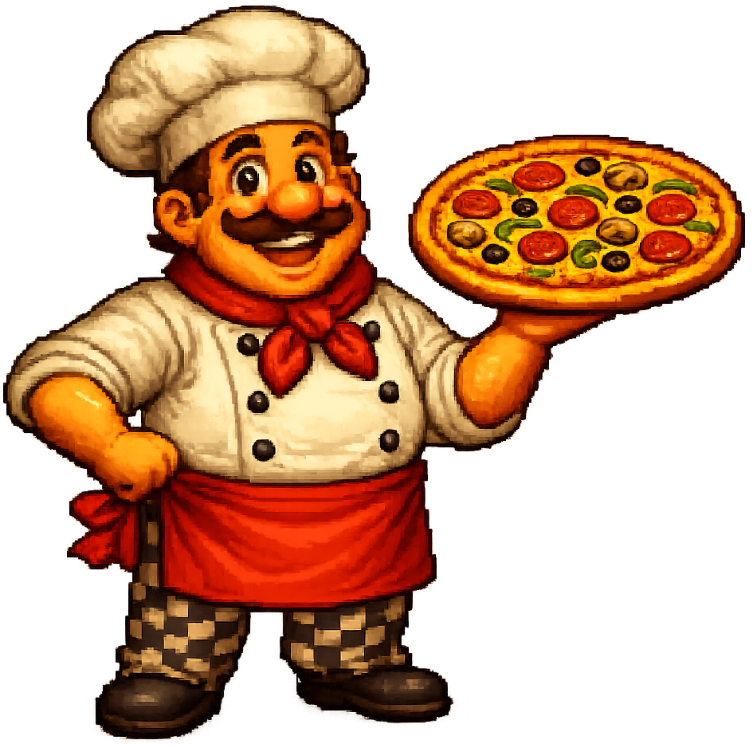

## Add auto-clickers

Add a helper that makes pizzas for you every second, even when you stop clicking.

> [!TASK]
>
> Add a helper sprite. The pizza shop uses a robot chef.
>
> Use your own helper, or save [the chef sprite](images/chef.png) and import it with **Upload**.
>
> 

> [!TASK]
>
> Make a variable called `chefs`{:class="block3variables"} for how many helpers you've hired, and tick it so the player can see it.

> [!TASK]
>
> Make a variable called `chef price`{:class="block3variables"} for how many pizzas the next helper costs. This climbs each time, so helpers get pricier.

> [!TASK]
>
> Make a variable called `pizzas per second`{:class="block3variables"} for how many pizzas your helpers make each second, and tick it.

> [!TASK]
>
> Make the helper buyable. Clicking it spends pizzas, hires one helper, and raises the price for next time.
>
> ```blocks3
> when this sprite clicked
> start sound (Clang v)
> change [pizzas v] by ((0) - (chef price))
> change [chefs v] by (1)
> set [chef price v] to (round ((chef price) * (1.15)))
> ```

Multiplying the price by `1.15` makes each helper cost about 15% more than the last. That steady climb is the trick behind every endless clicker.

> [!TIP]
>
> A **progression curve** controls how quickly a game gets harder, faster, or more expensive as the player improves.

> [!TASK]
>
> Make the helper appear only when affordable, and tell the game to recount the pizzas-per-second.
>
> ```blocks3
> when green flag clicked
> set drag mode [not draggable v]
> forever
> if <(pizzas) > ((chef price) - (1))> then
> show
> else
> hide
> end
> broadcast (update v)
> end
> ```

> [!TASK]
>
> Click the `Stage`{:class="block3looks"}. In `My Blocks`{:class="block3custom"} click **Make a Block**, name it `update pizzas per second`, and build its definition.
>
> 
>
> ```blocks3
> define update pizzas per second
> set [pizzas per second v] to ((chefs) * (1))
> ```

> [!TIP]
>
> In many programming languages, a reusable block of code like this is called a **function**.

> [!TASK]
>
> Still on the Stage, add a script so any helper can ask for a recount.
>
> ```blocks3
> when I receive (update v)
> update pizzas per second
> ```

> [!TASK]
>
> Update the Stage's green flag script to start the game's clock: set the new variables, work out the rate once, then add the pizzas-per-second every second.
>
> ```blocks3
> when green flag clicked
> set [pizzas v] to (0)
> set [pizzas per click v] to (1)
> +set [chefs v] to (0)
> +set [chef price v] to (15)
> +update pizzas per second
> +forever
> wait (1) seconds
> change [pizzas v] by (pizzas per second)
> end
> ```

Buy a helper, then stop clicking. Your `pizzas`{:class="block3variables"} keep rising on their own.
