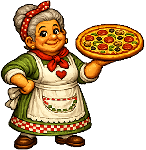
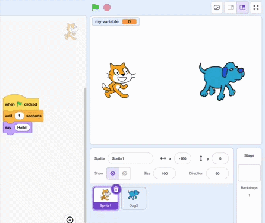

## Add a second helper

Add a second, more powerful helper that makes more pizzas per second than the first.

> [!TASK]
>
> Add another helper sprite. The pizza shop uses a granny, because grannies are pizza pros.
>
> Use your own helper, or save [the granny sprite](images/granny.png) and import it with **Upload**.
>
> 

> [!TASK]
>
> Copy your chef's two scripts onto the new sprite: drag each script from the code area and drop it onto the new sprite in the sprite list.
>
> > [!NOPRINT]
> >
> > 

> [!TASK]
>
> Make a variable called `grannies`{:class="block3variables"} for how many you've hired.

> [!TASK]
>
> Make a variable called `granny price`{:class="block3variables"} for how many pizzas the next one costs.

> [!TASK]
>
> In the copied buy script, swap the chef variables for the granny ones and pick a different sound.
>
> ```blocks3
> when this sprite clicked
> start sound (Collect v)
> change [pizzas v] by ((0) - (granny price))
> change [grannies v] by (1)
> set [granny price v] to (round ((granny price) * (1.15)))
> ```

> [!TASK]
>
> Swap the variables in the copied appear script too.
>
> ```blocks3
> when green flag clicked
> set drag mode [not draggable v]
> forever
> if <(pizzas) > ((granny price) - (1))> then
> show
> else
> hide
> end
> broadcast (update v)
> end
> ```

> [!TASK]
>
> Make each granny worth `5` a second. On the `Stage`{:class="block3looks"}, update the `update pizzas per second`{:class="block3custom"} definition.
>
> ```blocks3
> define update pizzas per second
> +set [pizzas per second v] to (((chefs) * (1)) + ((grannies) * (5)))
> ```

> [!TASK]
>
> Give the new variables their starting values on the Stage's green flag. A granny starts at `100` pizzas, pricier than a chef because she works harder.
>
> ```blocks3
> when green flag clicked
> set [pizzas v] to (0)
> set [pizzas per click v] to (1)
> set [chefs v] to (0)
> set [chef price v] to (15)
> +set [grannies v] to (0)
> +set [granny price v] to (100)
> update pizzas per second
> forever
> wait (1) seconds
> change [pizzas v] by (pizzas per second)
> end
> ```

Buy chefs, then save for a granny and watch your pizzas-per-second jump. You now have a full endless clicker: clicks, upgrades, and helpers all working together.
