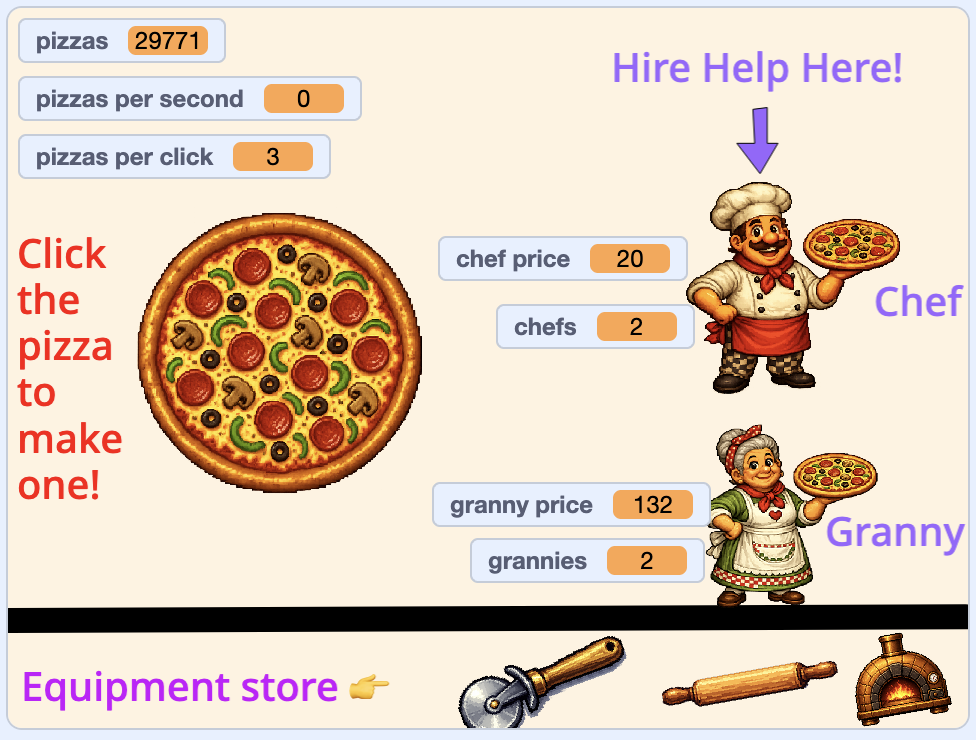

## Add a backdrop

Right now the game works, but it's plain. Give it a proper shop front and tidy up the readouts so the player knows what everything means.

> [!TASK]
>
> Paint a new backdrop. Hover over **Choose a Backdrop** (bottom-right) and click **Paint** to make a blank one.

> [!TASK]
>
> Use the **Text** tool in the paint editor to add labels and instructions. The pizza shop uses "Click the pizza to make one!", "Hire Help Here!", and "Equipment store". Use your own words and colours.

> [!TASK]
>
> Drag your sprites into place on the stage. The pizza shop puts the pizza in the middle, the chef and granny on the right, and the equipment along the bottom.

> [!TASK]
>
> Drag each variable readout where you want it. The pizza shop stacks `pizzas`{:class="block3variables"}, `pizzas per second`{:class="block3variables"} and `pizzas per click`{:class="block3variables"} top-left, puts `chef price`{:class="block3variables"} and `chefs`{:class="block3variables"} by the chef, and `granny price`{:class="block3variables"} and `grannies`{:class="block3variables"} by the granny.

> [!TIP]
>
> The score, prices, and other information shown on top of a game are often called the **HUD**, short for **heads-up display**.

Here's the pizza shop's layout. Yours can look however you like.

