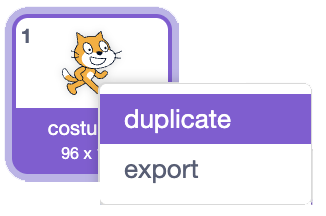
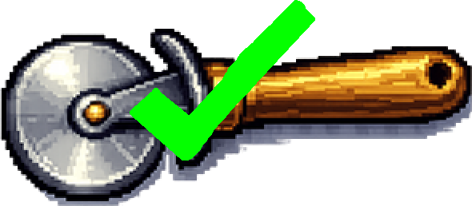

## Add your first equipment

Equipment lets the player upgrade every click.

<h2 class="c-project-heading--explainer">What you need to do</h2>

## Step 1

Add a new sprite that looks like it could improve each click. The example project uses a cutter.

Use your own equipment, or save [the cutter sprite](images/cutter.png) and import it with **Upload**.

Resize it and drag it near the bottom of the Stage, leaving room for two more equipment sprites. The example cutter is `30`% size.

## Step 2

Open the **Costumes** tab. Right-click the equipment costume and choose **duplicate**.

Keep the plain costume first and the copied costume second.

## Step 3

Change the second costume so it clearly shows the equipment has been bought. The example project adds a green tick.

## Now run your code

You'll make the cutter appear when the player can afford it next.
